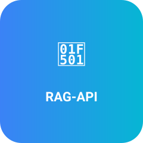

# <div align="center">
#
# 
#
#
# <h1>🔁 RAG-API</h1>
#
# <p><em>Like a relay race — pass the baton, not the whole playbook.</em></p>
#
# [](https://github.com/danishsyed-dev/RAG-API/actions/workflows/ci.yml)
#
# </div>


A lightweight **Retrieval-Augmented Generation (RAG)** API built with FastAPI, ChromaDB, and Ollama. Query your knowledge base with natural language and get intelligent responses powered by local LLMs.

## ✨ Features

- **🚀 Fast & Lightweight** — Built with FastAPI for high performance
- **📚 Vector Search** — ChromaDB for efficient document retrieval with chunking
- **🤖 Local LLM** — Uses Ollama with TinyLlama for fast, private inference
- **📄 Document CRUD** — Add, list, and delete documents via API
- **🏥 Health Checks** — Built-in health endpoint for monitoring
- **☸️ Kubernetes Ready** — Full K8s deployment manifests with probes & resource limits
- **🧪 CI/CD Pipeline** — Automated testing with GitHub Actions & pytest
- **🔒 Privacy-First** — Everything runs locally, no external API calls
- **⚙️ Configurable** — All settings via environment variables or `.env` file

## 🛠️ Tech Stack

| Component | Technology |
|-----------|------------|
| API Framework | [FastAPI](https://fastapi.tiangolo.com/) |
| Vector Database | [ChromaDB](https://www.trychroma.com/) |
| LLM | [Ollama](https://ollama.ai/) (TinyLlama) |
| Configuration | [pydantic-settings](https://docs.pydantic.dev/latest/concepts/pydantic_settings/) |
| Container Orchestration | [Kubernetes](https://kubernetes.io/) / [Minikube](https://minikube.sigs.k8s.io/) |
| CI/CD | [GitHub Actions](https://github.com/features/actions) |

## 📋 Prerequisites

- Python 3.9+
- [Ollama](https://ollama.ai/) installed and running
- TinyLlama model pulled: `ollama pull tinyllama`
- (Optional) [Minikube](https://minikube.sigs.k8s.io/) for Kubernetes deployment

## 🚀 Quick Start

### 1. Clone the repository
```bash
git clone https://github.com/danishsyed-dev/RAG-API.git
cd RAG-API
```

### 2. Create virtual environment
```bash
python -m venv venv

# Windows
venv\Scripts\activate

# macOS/Linux
source venv/bin/activate
```

### 3. Install dependencies
```bash
pip install -r requirements.txt

# For development & testing
pip install -r requirements-dev.txt
```

### 4. Configure (optional)
```bash
cp .env.example .env
# Edit .env to customize settings
```

### 5. Seed initial data
```bash
python embed.py
```

### 6. Start the server
```bash
uvicorn app:app --reload
```

The API will be available at `http://localhost:8000`

## 📡 API Endpoints

### Health Check
```http
GET /health
```

**Response:**
```json
{
  "status": "healthy",
  "database": "healthy",
  "llm": "healthy",
  "document_count": 5
}
```

### Query Knowledge Base
```http
POST /query
Content-Type: application/json

{
  "query": "What is Kubernetes?",
  "n_results": 3
}
```

**Response:**
```json
{
  "answer": "Kubernetes is a container orchestration platform used to manage containers at scale.",
  "sources": [
    {
      "content": "Kubernetes is a container orchestration platform...",
      "id": "k8s_chunk_0",
      "metadata": {"source": "k8s.txt", "chunk_index": 0}
    }
  ]
}
```

### Add Document
```http
POST /documents
Content-Type: application/json

{
  "text": "Docker is a containerization platform.",
  "id": "docker_intro",
  "metadata": {"source": "manual"}
}
```

### List Documents
```http
GET /documents?limit=10&offset=0
```

### Delete Document
```http
DELETE /documents/{doc_id}
```

## 📚 Document Ingestion

The `embed.py` script supports flexible document ingestion with automatic chunking:

```bash
# Embed the default k8s.txt file
python embed.py

# Embed a specific file
python embed.py --file docs/guide.txt

# Embed all .txt and .md files in a directory
python embed.py --dir ./documents

# Customize chunking parameters
python embed.py --file guide.txt --chunk-size 300 --overlap 50
```

## ☸️ Kubernetes Deployment

Deploy to a local Minikube cluster:

### 1. Start Minikube
```bash
minikube start
```

### 2. Build the image inside Minikube
```bash
minikube image build -t rag-api:latest .
```

### 3. Apply Kubernetes manifests
```bash
kubectl apply -f k8s/
```

### 4. Pull the LLM model
```bash
kubectl exec deploy/ollama -- ollama pull tinyllama
```

### 5. Access the API
```bash
kubectl port-forward svc/rag-api 8000:8000
```

Your API is now available at `http://127.0.0.1:8000`

## 🧪 Testing

### Run the full test suite
```bash
pytest tests/ -v
```

Tests run in mock LLM mode automatically — no Ollama server required.

### Run a manual smoke test (requires running server)
```bash
python semantic_test.py
```

### Mock LLM Mode (for CI/development)
```bash
USE_MOCK_LLM=1 uvicorn app:app --reload
```

## 📁 Project Structure

```
RAG-API/
├── .github/
│   └── workflows/
│       └── ci.yml           # GitHub Actions CI pipeline
├── k8s/
│   ├── ollama.yaml          # Ollama deployment & service
│   └── rag-api.yaml         # RAG API deployment & service
├── tests/
│   ├── conftest.py          # Shared pytest fixtures
│   ├── test_health.py       # Health endpoint tests
│   ├── test_query.py        # Query endpoint tests
│   ├── test_documents.py    # Document CRUD tests
│   └── test_embed.py        # Chunking unit tests
├── app.py                   # FastAPI application
├── config.py                # Centralized configuration
├── embed.py                 # Document ingestion with chunking
├── semantic_test.py         # Legacy smoke test
├── Dockerfile               # Container image definition
├── .dockerignore            # Docker build exclusions
├── .env.example             # Environment variable template
├── k8s.txt                  # Sample knowledge document
├── requirements.txt         # Production dependencies
├── requirements-dev.txt     # Dev/test dependencies
├── CONTRIBUTING.md          # Contribution guidelines
├── LICENSE                  # MIT License
└── README.md
```

## ⚙️ Configuration

All settings are configurable via environment variables or a `.env` file. See [`.env.example`](.env.example) for a full list.

| Setting | Env Variable | Default | Description |
|---------|-------------|---------|-------------|
| ChromaDB path | `CHROMADB_PATH` | `./db` | Vector database storage location |
| Collection name | `COLLECTION_NAME` | `docs` | ChromaDB collection name |
| LLM model | `LLM_MODEL` | `tinyllama` | Ollama model for inference |
| Ollama host | `OLLAMA_HOST` | `http://localhost:11434` | Ollama server URL |
| Mock LLM | `USE_MOCK_LLM` | `0` | Set to `1` for CI testing |
| CORS origins | `CORS_ORIGINS` | `*` | Comma-separated allowed origins |
| Max query length | `MAX_QUERY_LENGTH` | `1000` | Maximum query string length |
| Results per query | `DEFAULT_N_RESULTS` | `3` | Context chunks retrieved per query |
| Chunk size | `CHUNK_SIZE` | `500` | Characters per document chunk |
| Chunk overlap | `CHUNK_OVERLAP` | `50` | Overlapping characters between chunks |

## 🔄 CI/CD Pipeline

The GitHub Actions workflow:
1. Triggers on pushes to `main` and pull requests
2. Installs dependencies from `requirements-dev.txt`
3. Rebuilds embeddings
4. Runs the full pytest suite in mock LLM mode
5. Can be triggered manually via `workflow_dispatch`

## 📄 License

[MIT License](LICENSE) — feel free to use this project for your own purposes.

## 🤝 Contributing

Contributions are welcome! See [CONTRIBUTING.md](CONTRIBUTING.md) for guidelines.

---

Made with ❤️ using FastAPI, ChromaDB, Ollama, and Kubernetes
